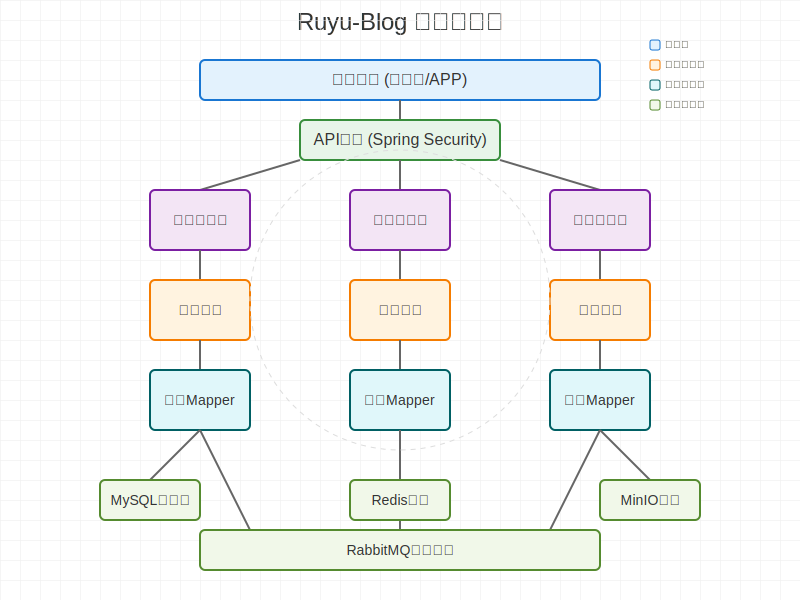

# Ruyu-Blog 开源博客系统


## 📋 项目概览

**Ruyu-Blog** 是一个基于 Spring Boot 3.1.4 + Vue 3 构建的现代化、完整的博客系统，采用前后端分离架构设计。系统集成了完整的用户管理、内容管理、权限控制、消息队列、缓存系统等企业级功能模块，为个人博客提供一站式解决方案。

### 🏗️ 系统架构

- **🔄 前后端分离** - 后端提供 RESTful API，前端独立部署
- **🏢 后端单体架构** - 所有功能模块集成在一个 Spring Boot 应用中
- **🌐 双前端设计** - 包含博客前台展示和管理后台两个独立前端项目
- **📦 容器化部署** - 支持 Docker 容器化部署，简化运维流程

#### 后端架构图



后端采用经典的三层架构设计，包括控制层(Controller)、业务层(Service)和数据访问层(Mapper)，并整合了缓存(Redis)、消息队列(RabbitMQ)、对象存储(MinIO)等中间件，实现高性能、高可用的博客系统后端服务。

#### 前端架构图


前端采用Vue 3 + Vite + TypeScript技术栈，使用Pinia进行状态管理，Vue Router处理路由，结合Tailwind CSS实现响应式UI设计，构建了高性能、现代化的用户界面。

## 🎨 项目预览

### 前台展示


### 后台管理


## 🛠️ 技术栈架构

### 后端技术栈
- **Spring Boot 3.1.4** - 主框架，提供自动配置和快速开发能力
- **Spring Security 6.x** - 安全框架，处理认证和授权
- **Spring AOP** - 面向切面编程，实现日志记录和权限控制
- **MyBatis-Plus 3.5.3** - ORM框架，简化数据库操作
- **MySQL 8.0+** - 主数据库，存储业务数据
- **Redis 6.0+** - 缓存数据库，提供高性能数据访问
- **MinIO** - 对象存储服务，处理文件上传和管理
- **RabbitMQ** - 消息队列，处理异步任务和解耦系统
- **Lombok** - 简化Java代码编写
- **Hutool** - Java工具类库，提供丰富的工具方法
- **FastJSON** - JSON处理库
- **JWT** - 无状态身份验证
- **Knife4j** - API文档生成和测试工具

### 前端技术栈
- **Vue 3** - 渐进式JavaScript框架
- **Vite** - 下一代前端构建工具
- **TypeScript** - 静态类型检查
- **Tailwind CSS/Unocss** - 实用优先的CSS框架
- **Pinia** - 状态管理
- **Vue Router** - 路由管理

## 📁 项目结构

```
Ruyu-Blog/
├── blog-backend/          # 后端项目（Spring Boot）
│   ├── src/               # 后端源码
│   ├── pom.xml            # Maven依赖配置
│   └── Dockerfile         # Docker构建文件
├── blog-frontend/         # 前端项目目录
│   ├── kuailemao-admin/   # 管理后台前端
│   └── kuailemao-blog/    # 博客前台前端
├── sql/                   # 数据库脚本
├── img/                   # 项目截图
└── README.md              # 项目文档
```

### 后端核心结构

```
blog-backend/src/main/java/xyz/kuailemao/
├── BlogBackendApplication.java  # 应用启动类
├── annotation/                  # 自定义注解（访问限制、黑名单检查、日志记录等）
├── aop/                         # 切面编程实现
├── config/                      # 配置类（安全、缓存、消息队列等）
├── constants/                   # 常量定义
├── controller/                  # 控制器层（处理HTTP请求）
├── domain/                      # 数据模型层（实体、DTO、VO）
├── enums/                       # 枚举类
├── exceptions/                  # 异常处理
├── filter/                      # 过滤器
├── handler/                     # 处理器
├── interceptor/                 # 拦截器
├── mapper/                      # 数据访问层
├── service/                     # 业务逻辑层
└── utils/                       # 工具类
```

## ✨ 核心功能特点

### 🔐 完整的认证授权体系
- JWT + Spring Security + RBAC权限模型
- 支持邮箱注册、第三方登录(Gitee/GitHub)
- 细粒度的权限控制机制

### 📝 丰富的内容管理功能
- **文章系统**：文章发布、编辑、分类、标签管理
- **评论系统**：多级评论、回复通知、评论审核
- **分类管理**：文章分类、层级结构
- **标签系统**：文章标签、热门标签展示
- **友链管理**：友链申请、审核、展示
- **树洞功能**：匿名留言、情感分享
- **留言板**：访客留言、管理员回复

### 🚀 高性能与可靠性
- **多级缓存策略**：Redis缓存 + 本地缓存
- **接口访问限流**：基于令牌桶算法实现
- **异步消息处理**：RabbitMQ处理邮件通知等异步任务
- **安全防护机制**：黑名单系统、IP限制、接口防刷

### 📊 完善的日志与监控
- AOP统一日志记录
- 操作审计追踪
- 全局异常捕获与处理

### 🛠️ 开发与部署支持
- 多环境配置（开发、生产）
- Docker容器化支持
- API文档自动生成（Knife4j）

## 🚀 快速开始

### 环境要求
- **后端**：JDK 17+、MySQL 8.0+、Redis 6.0+、RabbitMQ 3.8+、Maven 3.6+
- **前端**：Node.js 16+、npm/pnpm/yarn

### 1. 初始化数据库

1. 执行 `sql/Ruyu-Blog.sql` 脚本初始化数据库
2. 根据需要导入版本更新脚本

### 2. 配置后端项目

1. 打开 `blog-backend/src/main/resources/application.yml`
2. 配置数据库连接信息
3. 配置Redis、RabbitMQ、MinIO等中间件连接信息
4. 配置JWT安全相关参数

### 3. 启动后端服务

```bash
cd blog-backend
mvn spring-boot:run
# 或构建后运行
mvn clean package
java -jar target/blog-backend.jar
```

后端服务启动后，可访问 `http://localhost:8088/doc.html` 查看API文档

### 4. 配置前端项目

1. 配置开发环境变量

对于管理后台：
```bash
# blog-frontend/kuailemao-admin/.env.development
VITE_APP_BASE_URL=http://localhost:8088
VITE_APP_BASE_API=/api
VITE_APP_DOMAIN_NAME_FRONT=http://localhost:99
```

对于博客前台：
```bash
# blog-frontend/kuailemao-blog/.env.development
VITE_APP_BASE_URL=http://localhost:8088
VITE_APP_BASE_API=/api
```

### 5. 启动前端服务

管理后台：
```bash
cd blog-frontend/kuailemao-admin
pnpm install  # 或 npm install
pnpm run dev  # 或 npm run dev
```

博客前台：
```bash
cd blog-frontend/kuailemao-blog
pnpm install  # 或 npm install
pnpm run dev  # 或 npm run dev
```

## 🐳 Docker部署

### 后端部署

```bash
cd blog-backend
docker build -t ruyu-blog-backend .
docker run -d -p 8088:8088 --name ruyu-blog-backend ruyu-blog-backend
```

### 前端部署

以管理后台为例：
```bash
cd blog-frontend/kuailemao-admin
docker build -t ruyu-blog-admin .
docker run -d -p 99:80 --name ruyu-blog-admin ruyu-blog-admin
```

## 🚨 常见问题解决

### 前端启动错误

**问题**：前端启动时遇到 `Cannot read properties of null (reading 'split')` 错误

**解决方案**：
1. 检查环境变量配置文件
2. 确保 `VITE_APP_BASE_URL`、`VITE_APP_BASE_API` 等配置不为空
3. 重新启动前端项目

### Git钩子问题

**问题**：遇到 `husky - .git can't be found` 错误

**解决方案**：
```bash
cd 项目根目录
git init  # 如果不是git仓库
```

## 🤝 参与贡献

1. Fork 项目仓库
2. 创建功能分支
3. 提交代码
4. 推送到远程仓库
5. 创建 Pull Request

## 📄 许可证

本项目采用 MIT 许可证 - 详见 [LICENSE](LICENSE) 文件

## 📧 联系我们

如有问题或建议，欢迎加入交流群：


---

*文档持续更新中，如有问题请提交Issue或联系维护者*
